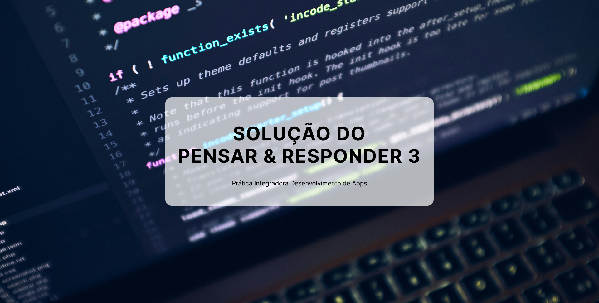

<h1 align="center"> Pensar & Responder III </h1>

 Solução do P&R da disciplina Prática Integradora Desenvolvimento de Apps 
  

## Visão Geral

Esse projeto foi desenvolvido para realização de uma atividade prática simples de criação de um `respositório no Github` com apenas os arquivos  `index.html`, `README.md` (de forma opcional) e uma pasta `images`.

##  Autor
Projeto desenvolvido por Tatyane Gonçalves.
